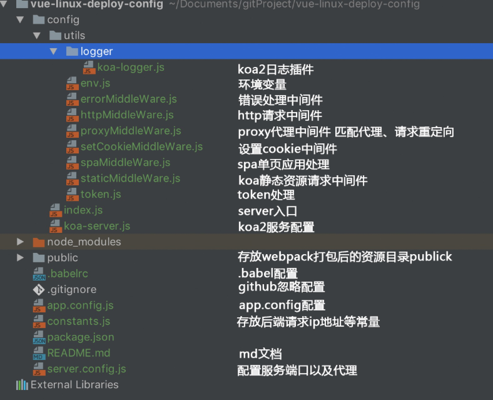

# vue-linux-deploy-config
Vue单页应用服务器端部署项目配置

### 技术栈
* Koa2
* Nginx
* Linux

目录结构




##Linux
github添加SSH密钥
```html
ssh-keygen -t rsa -C"mail@mail.com"
```
常用git命令
```html
git help　　　　　　　　　　　　　　　　　　　　　　　　　　　　　　　　　#可查看git的常用命令
git config --global user.name "Your Name Here"　　　　　　　　　　 #设置commit的署名
git config --global user.email "your_email@example.com"　　　　　　#设置commit的email
git config [--local|--global|--system] --list/-l　　　　　　　　　　#查看本地的global信息
git config [--local|--global|--system] --unset[-all] user.name　　#删除user.name信息。如果user.name对应多个值，可用unset-all来删除
git remote add XXX https://github.com/username/repo_name.git　 　　#设置github的连接
git clone git://github.com/your_account/aimed_repo.git　　　　　　　#复制一个repo到本地 
git remote -v　　　　　　　　　　　　　　　　　　　　　　　　　　　　　　　#查看本地设置的url连接信息 
git status　　　　　　　　　　　　　　　　　　　　　　　　　　　　　　　　　#查看当前工作的
branch git branch　　　　　　　　　　　　　　　　　　　　　　　　　　　　 #查看本地所有的
branch git branch -a　　　　　　　　　　　　　　　　　　　　　　　　　　　#查看远程的所有分支 
git branch -d branch_name　　　　　　　　　　　　　　　　　　　　　　　   #删除本地branch_name这一分支 
git push origin --delete branch_name　　　　　　　　　　　　　　　　 　 #删除名为branch_name的远程分支 
git checkout branch_name　　　　　　　　　　　　　　　　　　　　　　　　　#切换到名为branch_name的分支上 
git chechout -b branch_name　　　　　　　　　　　　　　　　　　　　　　  #在本地新建一个名为branch_nam的分支 
git diff test_branch_name　　　　　　　　　　　　　　　　　　　　　　　  #查看当前branch与test_branch_name中代码的区别 
git mv filename newfilename　　　　　　　　　　　　　　　　　　　　　　#文件重命名 
git push XXX branch_name　　　　　　　　　　　　　　　　　　　　　　　　#上传指定的branch到远端 
git pull　　　　　　　　　　　　　　　　　　　　　　　　　　　　　　　　　　#将远程上的版本与本地版本进行合并，相当于get fetch + git merge 
git reset --hard　　　　　　　　　　　　　　　　　　　　　　　　　　　　 #将刚才进行的git pull所进行的操作取消，恢复本地版本合并前的原貌
```

linux下 启动node 和关闭node

 

1.用forever  进行管理
```html

npm install -g forever

forever start app.js   //启动

forever stop app.js   //关闭
```
2.用自带的服务nohub
```html
nohup node index.js > myLog.log 2>&1 &      //启动

pkill node   //关闭 node 服务

```
